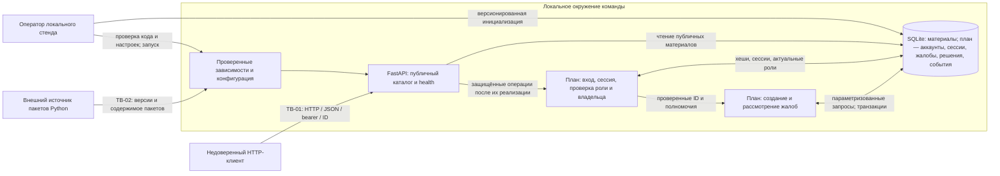

# Модель угроз

Основа: [паспорт проекта](PROJECT.md), [требования SR-01–SR-10](SECURITY_REQUIREMENTS.md) и метод S03. Связанные инженерные решения находятся в [DESIGN_DECISIONS.md](DESIGN_DECISIONS.md). Значимые объекты и последствия нарушений описаны в разделе 5 паспорта; отдельный реестр активов не создаётся.

## 1. Состояние и граница модели

**Состояние на этапе S04:** в репозитории существуют проектные документы; сервер, база и защитные механизмы пока не реализованы. Ниже описана планируемая архитектура. Наличие SR, T и D не означает, что защита уже работает или что будущие проверки выполнены.

**Цель минимальной основы к S05:** локальный FastAPI-сервер, SQLite, проверка работоспособности и чтение публичного учебного каталога. Вход, жалобы, рассмотрение и защитные механизмы этих операций относятся к последующей реализации. Их отсутствие не заменяется временным доверием к переданным клиентом `user_id` или `role`.

**Существенные допущения:**

- Используются только синтетические материалы, жалобы и аккаунты. Регистрации, загрузки файлов, внешних интеграций и отдельного frontend нет.
- Поддерживается один локальный процесс приложения с SQLite. Сервер слушает loopback; HTTP без TLS допустим только для этой локальной учебной демонстрации. Доступ из внешней сети потребует пересмотра модели, транспорта и развёртывания до открытия доступа.
- Клиент не считается доверенным, даже если это `curl` с того же компьютера: он может менять URL, тело JSON, заголовки, идентификаторы, порядок и частоту запросов.
- Оператор управляет кодом, настройками, зависимостями и доступом к файлу SQLite. Захват ОС или произвольное исполнение кода с правами оператора выходит за границу защиты API. Возможное раскрытие копии БД или журнала учитывается отдельно в T-06; стойкий хеш не обеспечивает целостность базы при захвате ОС.
- Начальный каталог задаётся версионированным кодом. Внешнего файла импорта и маршрута произвольной загрузки начальных данных нет. Будущие учебные аккаунты создаёт оператор отдельно, без опубликованных паролей в репозитории.
- Прекращение процесса, ошибки БД, конкурентные запросы и повторный запуск возможны в штатном локальном окружении. Они входят в модель целостности, даже когда не вызваны атакующим.

## 2. Единственный архитектурный вид

Все компоненты этой схемы на этапе S04 **планируются**. Стрелки показывают данные и место принятия решения, а не уже реализованный поток.

**Точки входа:** публичные `GET /health` и `GET /materials`; в дальнейшем — вход по логину и паролю, создание жалобы, чтение собственных жалоб и рассмотрение жалобы модератором. Точные маршруты будущих операций не являются уже опубликованным контрактом API.

Параметры URL, причины жалобы и решения, выбор решения, логин, пароль и bearer-токен поступают от клиента. Будущий сервер определяет пользователя по действующей серверной сессии, получает актуальную роль из БД и проверяет владение выбранным объектом. Автор, исполнитель решения, исходный статус и время не назначаются клиентом. Чтение публичного каталога не открывает доступ к жалобам, решениям или аккаунтам.

## 3. Границы доверия и проверки данных

| Граница | Что пересекает | Почему нельзя доверять автоматически |
| --- | --- | --- |
| **TB-01: клиент → сервер** | URL, идентификаторы, JSON, логин/пароль, bearer-токен, повторные и одновременные запросы | Клиент может подделать идентичность и поля, выбрать чужой объект, вызвать закрытую операцию или обойти последовательность шагов. Сервер принимает окончательное решение о доступе и допустимом изменении. |
| **TB-02: внешний источник пакетов → исполняемое окружение** | Пакеты FastAPI, SQLAlchemy и их зависимости | Полученный извне код будет исполняться с доступом к данным приложения. Версия, происхождение и известные уязвимости требуют проверки до использования. |

API и SQLite находятся в одной административной границе; отдельный сетевой сервер БД не предполагается. Между ними всё же требуется обеспечивать корректную передачу клиентских значений как данных и атомарность нескольких записей. Встроенный seed и команды оператора — доверенный административный путь, но ошибка инициализации не должна незаметно менять сохранённые роли, решения и скрытые материалы.

## 4. Сценарии угроз и приоритеты

**Шкала:** высокий — доступный через основной сценарий путь к нарушению полномочий, раскрытию жалоб или несогласованному решению, который определяет архитектуру сейчас; средний — существенный риск с более ограниченным входом или требующий отдельного эксплуатационного условия. Приоритет не означает, что угроза уже устранена. Пометка **«приоритетный набор»** сделана один раз в каждой выбранной записи; связанные D закрывают проектные цепочки этого набора.

### T-01. Доступ к чужой жалобе и присвоение полномочий

- **Сценарий:** обычный пользователь подставляет ID чужой жалобы в чтение, вызывает операцию модератора напрямую или добавляет `author_id`, `moderator_id`, `role` в JSON. Если API доверяет полю клиента либо проверяет право только в одном маршруте, атакующий читает чужую причину, создаёт жалобу от другого лица или скрывает материал.
- **Объект и свойство:** конфиденциальность жалобы, достоверность автора и исполнителя, разграничение полномочий. **Вход:** TB-01; чтение, создание и рассмотрение жалоб.
- **Связи:** SR-01 → [D-01](DESIGN_DECISIONS.md#d-01) → проверка подмены идентификаторов и прямых вызовов.
- **Приоритет: высокий; приоритетный набор.** Для атаки достаточно обычной учётной записи и изменения HTTP-запроса; затрагиваются все основные сценарии.

### T-02. Получение чужой идентичности через вход или недействующий контекст

- **Сценарий:** атакующий многократно подбирает пароль модератора, использует параллельные попытки для обхода неатомарного счётчика либо предъявляет произвольный или истёкший токен. Если сервер не ограничивает вход или принимает недействующий контекст, дальнейшая проверка роли считает атакующего законным модератором.
- **Объект и свойство:** подлинность пользователя и доступ к привилегированным действиям. **Вход:** TB-01; будущая операция входа и заголовок авторизации.
- **Связи:** SR-01, SR-04, SR-07 → [D-01](DESIGN_DECISIONS.md#d-01) → проверки входа, истечения сессии и параллельных неудачных попыток. SR-04 обеспечивает безопасное представление пароля; самостоятельно хеширование не останавливает сетевой перебор.
- **Приоритет: высокий; приоритетный набор.** Компрометация одного модераторского аккаунта даёт право менять результат рассмотрения. Локальный адрес не делает автоматически доверенным каждый клиентский запрос.

### T-03. Несогласованность из нескольких допустимых решений

- **Сценарий:** два модератора одновременно читают одну жалобу как ожидающую и сохраняют разные окончательные решения. Возможен и другой случай: они рассматривают **две разные жалобы на один материал**; удовлетворение первой скрывает материал, а отклонение второй ошибочно возвращает его в доступное состояние, если сервер присваивает видимость по последнему решению.
- **Объект и свойство:** единственность решения по жалобе и согласованное состояние общего материала. **Вход:** TB-01 и транзакции рассмотрения в SQLite.
- **Связи:** SR-06 → [D-02](DESIGN_DECISIONS.md#d-02) → проверки двух соединений с БД, повторного рассмотрения и двух жалоб одного материала.
- **Приоритет: высокий; приоритетный набор.** Достаточно двух корректных запросов, специальная атака не нужна. Проверка `pending` вне транзакции или уникальность решения только по ID жалобы не обеспечивает весь инвариант материала.

### T-04. Частичное рассмотрение при ошибке записи

- **Сценарий:** после сохранения решения возникает ошибка при смене статуса жалобы, скрытии материала или записи события; либо процесс завершается между отдельными фиксациями. При независимых commit в БД остаётся только часть результата, а повтор запроса может добавить второе решение.
- **Объект и свойство:** атомарность решения, состояния материала и обязательного следа действия. **Вход:** многошаговая операция рассмотрения; сбой БД или процесса.
- **Связи:** SR-06, SR-09, SR-10 → [D-02](DESIGN_DECISIONS.md#d-02) → искусственный сбой между записями с повторным чтением состояния из нового соединения.
- **Приоритет: высокий; приоритетный набор.** Сбой реалистичен и непосредственно нарушает основной сценарий. Ответ HTTP с ошибкой сам по себе не подтверждает откат в БД.

### T-05. Изменение SQL через клиентский ввод

- **Сценарий:** пользователь передаёт SQL-метасимволы в причине жалобы, ID, фильтре или параметре сортировки. Если сервер соединяет строку запроса с этим значением, атакующий меняет условие выборки либо запись и получает чужие жалобы или изменяет данные.
- **Объект и свойство:** конфиденциальность и целостность записей и схемы БД. **Вход:** TB-01; любой клиентский параметр, используемый при обращении к SQLite.
- **Связи:** SR-05 → [D-03](DESIGN_DECISIONS.md#d-03) → проверка значений со SQL-метасимволами и разрешённого набора полей сортировки. Будущие необязательные фильтры учитываются только если будут добавлены.
- **Приоритет: высокий; приоритетный набор.** Клиент управляет значениями в основных операциях; способ построения запросов выбирается до их реализации. Использование ORM само по себе не запрещает небезопасный raw SQL.

### T-06. Раскрытие пароля или токена вне операции входа

- **Сценарий:** копия SQLite, исходный seed, диагностический ответ или журнал содержит открытый пароль либо bearer-токен. Получивший такую копию использует секрет для доступа от чужого имени; быстрый хеш допускает дешёвый офлайн-подбор пароля.
- **Объект и свойство:** секреты аккаунтов и сессий. **Вход:** файл БД, код инициализации, ответы и журналы приложения.
- **Связи:** SR-04, SR-09; [D-01](DESIGN_DECISIONS.md#d-01) описывает хранение учётных данных, [D-03](DESIGN_DECISIONS.md#d-03) — безопасный вывод.
- **Приоритет: средний.** Последствия серьёзны, но сценарий требует раскрытия отдельного файла или ошибочного диагностического вывода. Он учитывается выбранными решениями; защита файлов средствами ОС остаётся обязанностью оператора, а хеширование не защищает от слабого пароля полностью.

### T-07. Небезопасный код сторонней зависимости

- **Сценарий:** при установке окружения команда получает подменённый пакет из непроверенного источника или версию с известной применимой уязвимостью. Выполняющийся в сервере код читает или изменяет аккаунты, жалобы и решения.
- **Объект и свойство:** целостность исполняемого окружения и всех доступных ему данных. **Вход:** TB-02; установка прямых и транзитивных зависимостей.
- **Связь:** SR-03. Фиксация зависимостей и проверка их происхождения относятся к подготовке запуска; специальный автоматизированный анализ вводится далее по курсу.
- **Приоритет: средний.** Вход находится на этапе контролируемой установки, а не в обычном HTTP-запросе. Фиксация версии сама по себе не доказывает отсутствие уязвимостей; требование остаётся применимым, полноценное решение цепочки поставок не заявляется выполненным.

### T-08. Инициализация повреждает уже существующее состояние

- **Сценарий:** ошибка встроенного seed, частичный сбой или повторный запуск перезаписывает скрытый материал как доступный, меняет роль существующего аккаунта или оставляет только часть начального каталога. Импорт произвольного внешнего файла не предполагается и как существующий вход не моделируется.
- **Объект и свойство:** целостность начальных данных и сохранение уже принятых решений. **Вход:** доверенный административный путь инициализации БД.
- **Связь:** SR-08. Критерий требует транзакционной и повторяемой инициализации без перезаписи существующих предметных состояний.
- **Приоритет: средний.** Путь запускает оператор, но ошибка может отменить результат модерации; его необходимо проверить при появлении seed. Изменение встроенного каталога должно быть видно в истории исходного кода.

### T-09. Утечка внутренних данных через конфигурацию и ошибки

- **Сценарий:** сервер с настройками локальной отладки случайно открывается внешней сети, либо специально некорректный запрос вызывает ответ со стеком, SQL, путём к БД или секретом. Необдуманно доступная служебная схема дополнительно раскрывает внутренние операции.
- **Объект и свойство:** конфиденциальность конфигурации и внутренних данных. **Вход:** TB-01; ответы об ошибках, `/docs`, `/openapi.json`, настройки запуска.
- **Связи:** SR-02, SR-10; безопасные ответы предусмотрены [D-03](DESIGN_DECISIONS.md#d-03). Для раскрытия действующего секрета также применима T-06.
- **Приоритет: средний.** Внешнее развёртывание не входит в текущую границу; его появление требует пересмотра приоритета. Безопасные ошибки нужны и локально. Доступность публично разрешённой схемы API сама по себе не доказывает уязвимость.

### T-10. Утрата достоверного следа модерации и отказов

- **Сценарий:** решение записывается без исполнителя или времени, клиент назначает исполнителя в теле запроса, обычный пользователь меняет запись события через API либо отказы доступа не фиксируются. Позже нельзя установить, кто скрыл материал, и заметить повторные попытки доступа к чужим жалобам.
- **Объект и свойство:** достоверность и доступность истории значимых действий без раскрытия лишнего содержимого жалоб. **Вход:** операция рассмотрения, обработчики отказов и возможные маршруты событий.
- **Связь:** SR-09; [D-02](DESIGN_DECISIONS.md#d-02) связывает решение с записью аудита, [D-03](DESIGN_DECISIONS.md#d-03) определяет безопасные события отказов и их просмотр оператором.
- **Приоритет: средний.** Прямая предметная защита задаётся T-01–T-05; отсутствие следа ухудшает обнаружение и разбор нарушений. Угроза учтена в тех же решениях, но неизменяемость журнала перед администратором ОС не заявляется.

## 5. Покрытие и остающиеся ограничения

Выбранные D задают способ защиты всей отмеченной приоритетной группы. Это завершённость **проектных связей**, а не фактическое подтверждение безопасности. Условия, действия и наблюдаемые результаты будущих проверок находятся в соответствующих D; результаты будут добавлены после реализации и выполнения проверок.

Открытые вопросы не скрываются уменьшением приоритета: при появлении исполняемой основы необходимо проверить инициализацию, состав зависимостей и поведение ошибок; при реализации защищённых операций — сессии, ограничения входа, права, транзакции и события. Переход к нескольким процессам, другой СУБД, внешней сети, внешнему seed или интеграциям требует повторно проверить допущения и обновить текущие SR/T/D с сохранением идентификаторов.

Угрозы сформулированы по сценариям продукта. STRIDE использована как подсказка для проверки подмены идентичности, изменения данных, утраты следа, раскрытия и отказов, а не как требование создать отдельную строку на каждый класс. Публичный сетевой DoS не моделируется как поддерживаемый сценарий эксплуатации loopback-стенда; ограничение размеров ввода и списков при этом остаётся полезной границей обработки запросов в D-03.
